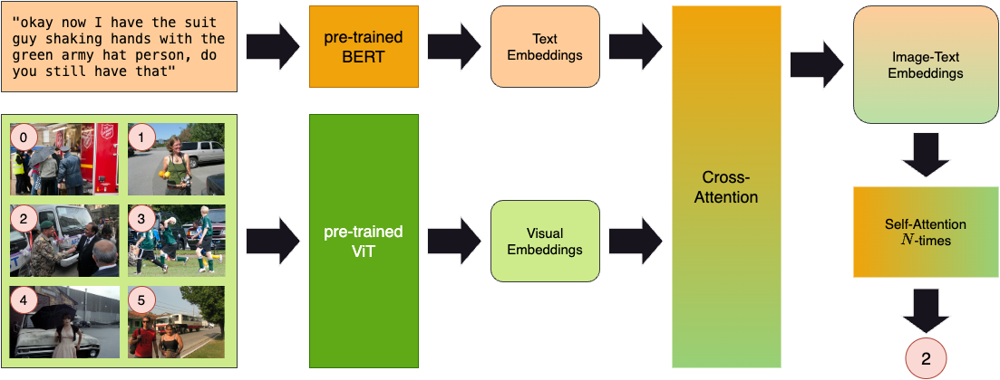

# Chat-Driven Image Matching with Transformer Models

## The PhotoBook Task and Dataset

We initiated our project from the 'The Photobool Dataset'. For the documentation and further information, please visit [https://dmg-photobook.github.io](https://dmg-photobook.github.io).

## Data preparations

The ./discriminator/data/extract_segments.py script is used to extract history based text-segments from the raw json data and transforms them to a format in which a text segment is matched to the paths of the six images occuring during this instance of the game.

Such matchings are used in the ./discriminator/tokenize_data.py script to generate the text and image encodings using Bert's and the ViT's <CLS>-Tokens and stores them. It also provides the Dataloader used within the training loop.

### Steps to run data preparation

For No-History Dataset:

1. Run tokenize_data.py script

For History-Dataset:

1. Run the extract_segments.py script
2. Replace the train_segments, val_segments and test_segments scripts in the ./discriminator/data folder by splits of the newly generated data
3. Run tokenize_data.py script

## Transformer architecture

We use the <CLS>-Tokens of Bert and the ViT as input to our model. The features are transformed by one dense layer each. After that the transformed features are put through a cross-attention layer to obtain combined image-text embeddings. These embeddings are further transformed by six self-attention blocks consisting of multi-head-attention followed by two feed-forward layers. Finally, we apply two dense feed-forward layer followed by the classification layer, implemented as sigmoid or softmax respectively. The model is depicted in the image given below and can be found in ./discriminator/models/vision_language_transformer.py and ./discriminator/models/vision_language_transformer_sigmoid.py. 

## Training the model

To train either of the models, verify that the files ./discriminator/data/train_segments.json and ./discriminator/data/val_segments.json exist and run the script ./discriminator/train_transformer_sigmoid.py or ./discriminator/train_transformer.py.
